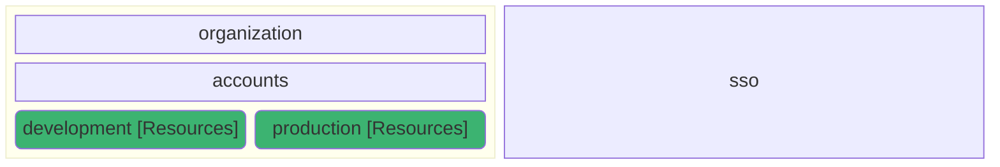
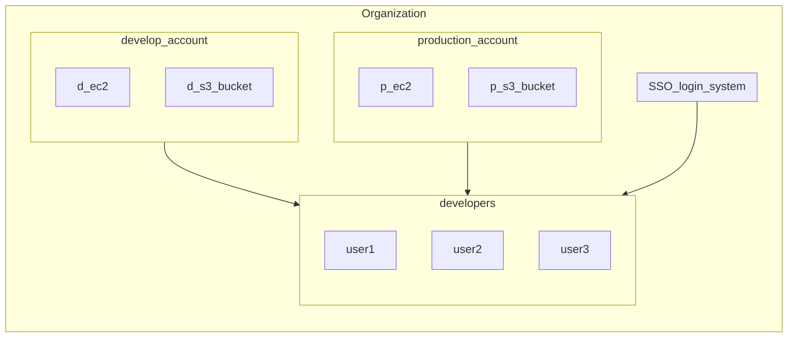

### 7. AWS Environments

how developers use sso login to get access by SSO system.  

we currently use `IAM Identity Center` but in the future we can change it by a specific user management base on our requirement such LDAP or external SSO start endpoint.

