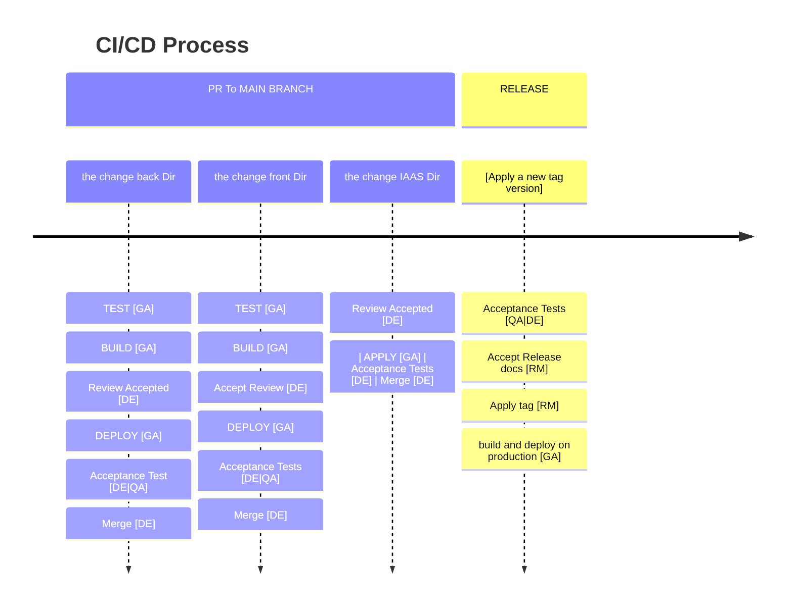

### 8. CI/CD process

```mermaid
timeline
        title CI/CD Process
        section PR To MAIN BRANCH
         the change back Dir : TEST [GA]: BUILD [GA]
               : Review Accepted [DE]: DEPLOY [GA]: Acceptance Test [DE|QA]: Merge [DE]
         the change front Dir : TEST [GA]: BUILD [GA]
                 :  Accept Review  [DE]: DEPLOY [GA]: Acceptance Tests [DE|QA]: Merge [DE]
         the change IAAS Dir : Review Accepted [DE]: | APPLY [GA] | Acceptance Tests [DE] | Merge [DE]
        section RELEASE
        [Apply a new tag version] : Acceptance Tests [QA|DE]: Accept Release docs [RM]: Apply tag [RM] 
               : build and deploy on production [GA]
          
          
```
`GA`Github Action   `DE` Developer   
`QA` Tester `RM` Release Manager

