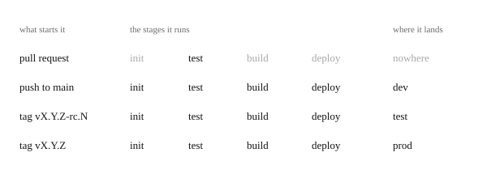
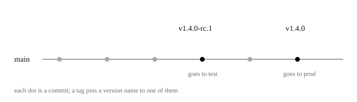

# The pipeline

A pipeline is a row of automatic steps that takes a change to a program, checks it, and delivers it to the people who use it. Think of an assembly line: every change passes the same stations, in the same order, every time. Nothing is forgotten, and nobody has to do it by hand.

\
Every change takes the same road. Machines check it and deliver it to dev. A person decides when it goes on to test, and then to the workshops.

At Hjulverkstan, the workshops use the portal every day to keep track of bikes, repairs and customers. If a change broke the portal, a workshop could stop. The pipeline makes sure a change reaches them only after it has been checked, and tried twice.

That is the whole idea. Each section below goes one step deeper, and you can stop wherever you have what you need.

*Everything in these pages is an agent's reading of `.github/workflows/` on 2026-09-29, not checked against a real run.*

## 1. Why a pipeline

Delivering changes by hand goes wrong in ways that are easy to predict: steps get forgotten, nobody knows what runs where, and releasing becomes rare and risky. A pipeline stops this by letting a machine do the same steps every time. Every part of ours exists to stop one of these problems.

\
The same four questions, answered by hand and by a pipeline.

*Reasoned. The problems of delivering by hand are common experience in software, not seen in this project's own history.*

### 1.1 Delivering by hand

Doing it by hand is a circle, where each problem makes the next one worse.

A developer builds the new version on their own laptop, copies it to the server, and restarts it. One day they forget a step, or their laptop has a setting the server does not. The portal stops working on a Monday morning in the workshop. Nobody is sure which version is running, or what changed. So people become afraid of releasing. They release rarely, and each release holds many changes, which makes the next one even riskier.

A pipeline breaks that circle. The steps are written down once and run by a machine, so none is forgotten. Every change is checked before it goes anywhere. Every version has a name, so anyone can see what runs where. And because releasing becomes safe and routine, it can happen often, in small steps that are easy to check.

*Reasoned, as above.*

### 1.2 CI and CD

The two halves of a pipeline have names you will meet everywhere: CI checks every change, and CD delivers it.

CI, continuous integration, means that every change is joined often into the shared code, the one version everyone works from, and checked automatically each time. Small changes checked often are easier to fix than big ones checked rarely. In ours, CI is the checks on every pull request, a proposed change, and before every deploy.

CD, continuous delivery, means that every checked change is delivered automatically, at least to a place where it can be tried. In ours, every accepted change goes by itself to dev, the copy for developers, because trying changes early is what dev is for. Test and prod, the copies for trying releases and for the workshops, wait for a person to make a release, so people, not the machine, decide when the workshops get a change.

*Seen, in `pr.yml` and `pipeline.yml`; the meaning of the two names is common usage.*

## 2. One change, from pull request to the workshops

The simplest way to see the whole pipeline is to follow one change on its way from a proposal, to dev, to test, and to the workshops. Each step goes further, and each one only happens if the step before it worked.

\
A pull request only runs the checks. The other events run the same four stages, and the event decides where the change lands. Note that "test" is two things: a stage that checks the change, and an environment where it lands.

*Seen, in `pr.yml` and `pipeline.yml`. The story beneath is an example, not a real run.*

### 2.1 The pull request is checked

Imagine you fix a wrong opening time on the public site. Before anyone accepts it, machines check that it breaks nothing.

You make the fix on a branch, your own copy of the code. You send it to GitHub, the site where our code is kept, and open a pull request: a request to add your change to `main`, the shared version. Soon a check appears on it. GitHub's machines have run the tests of the API, the server program that holds all the data, and checked that the web can still be built into a working site. Green means both passed. Nothing is deployed yet.

\
Your change lives on a branch until the pull request is merged into main.

*Seen, in `pr.yml`.*

### 2.2 The merge goes to dev

Once the pull request is accepted, the change goes live on dev by itself, so anyone can look at it.

The pull request is merged into `main`, and that starts the pipeline. It sees that only `web/` changed, so it tests, builds and deploys only the web. To deploy means to put it live. Dev is the copy of the system that always has the newest `main`.

*Seen, in `pipeline.yml`.*

### 2.3 A release goes to test, then prod

The workshops only get the change when a person decides to make a release, and it is tried on test first.

Someone adds a git tag, a name, to a commit, a saved version of the code, on `main`: `v1.4.0-rc.1`. The "rc" means release candidate, a version to try before the real release. The pipeline runs again, now with both the API and the web, and deploys to test, the copy where a release is tried. If it works, they add the tag `v1.4.0`, and the pipeline runs once more, to prod, the copy the workshops use. Nobody copied a file by hand.

*Seen, in `pipeline.yml`.*

## 3. Three copies of the system

Three separate copies are what make it safe to try things: a mistake on one copy cannot harm the others. The copies are called environments: dev, test and prod. Each has its own web (the public site and the portal staff use), API (the server program that holds the data) and database, and they differ only in what is allowed onto them.

\
The same three parts in each environment. Only what updates them, and who uses them, is different.

The data is separate too: a bike you add on dev never appears in prod.

*Seen, in `cdk/assets-ec2/docker-compose.yml` and `cdk/README.md`. What each is for is reasoned from the [release process](../../GUIDELINES.md#release-process-).*

## 4. What starts a run

What a developer does decides how far a change travels. A pull request, a proposed change, is only checked. A merge, accepting it into `main`, the shared version, reaches dev. A release tag reaches test or prod. A tag is a version name, such as `v1.4.0`, put on one saved version of the code.

Each of these starts a workflow, a file in `.github/workflows/` that GitHub runs when something happens.

- A pull request runs `pr.yml`: the API's tests and the web's build. It deploys nothing.

- A push to `main`, such as a merge, runs `pipeline.yml` and deploys to dev.

- A tag runs `pipeline.yml` too: `vX.Y.Z-rc.N` deploys to test, and `vX.Y.Z` to prod.

*Seen, in `pr.yml` and `pipeline.yml`.*

### 4.1 Why releases use tags

A tag names one exact commit, a saved version of the code, so everyone knows precisely what was released.

\
Two tags on main. The release candidate goes to test. The final version, on a later commit, goes to prod.

The pipeline adds two more rules. A tag must be on a commit that is on `main`, so everything released has been reviewed and merged. And it must be written `vX.Y.Z` or `vX.Y.Z-rc.N`, a common way to number versions called semantic versioning, so people and the pipeline can both read what kind of version it is. A tag in another form is refused.

The rc tag, for release candidate, comes first, so a release is tried on test before the workshops get it. How to make a release is in the [release process](../../GUIDELINES.md#release-process-).

*Seen, in `pipeline.yml` and the guidelines.*

### 4.2 Starting a run by hand

Sometimes something must run without a new change, so two workflows can also be started with a button, *Run workflow*, in the Actions tab: the page on GitHub that lists every run.

The button on `pipeline.yml` deploys to dev, and you choose what: the API, the web, both, or whatever changed. The other workflow, `publish.yml`, has only a button, and rebuilds the web when only its content has changed, as [the web's path](web.md#3-publish-rebuilding-when-only-the-content-changed) explains.

*Seen, in `pipeline.yml` and `publish.yml`.*

## 5. Inside one run

Every run does the same four stages in the same order, so a change that fails its checks is never built or deployed. The first stage, init, decides what to do, test checks it, build makes it, and deploy puts it on the environment. After test, the API and the web go separate ways.

\
The jobs of one run. Deploy web waits for deploy API, most likely so the new site never goes live before the API it talks to; the files do not say why. Build web waits only for test, so it runs while the API deploys.

*Seen, in `pipeline.yml`.*

### 5.1 Init decides what to deploy

Init only deploys the parts that changed, which saves time and leaves the other part untouched.

It chooses the environment from the event, and looks at which folders changed, `api/` or `web/`. If neither changed, the run stops, since there is nothing new to deliver. A tag always deploys both, because a release is the whole system at one exact version. Init writes its decisions at the top of the run's page.

*Seen, in `pipeline.yml`.*

### 5.2 Test checks what will be deployed

Test runs only the checks for the parts that will be deployed: the API's tests, a build of the web, or both.

The web's build needs an API to read content from, because the site's text and images are stored in the API's database. So the check starts an API just for this.

*Seen, in `stage-test.yml`.*

### 5.3 Build and deploy, one path for each part

The API and the web travel in different ways, because the API's package can be moved between environments and the web's files cannot. Build makes the API into a Docker image, a packaged app, and the web into a folder of finished files. Deploy puts them on the environment.

Each has a page, for when you need to know how your part is built and where it ends up.

[The API's path](api.md)

[The web's path](web.md)

*Seen, in `pipeline.yml`.*

## 6. Looking at a run

Reading one successful run is the quickest way to feel at home in the pipeline, and it makes a failed run much easier to read later. Every run can be watched on GitHub. Try it:

1. Open the Actions tab and choose *Deploy* on the left. That is the name `pipeline.yml` gives itself, in its first line.

2. Open the newest run. The summary at the top is from init: the environment, and whether it deployed the API, the web or both.

3. Below it is the graph of jobs from [§5](#5-inside-one-run). A job with nothing to do is shown as skipped.

4. Open a job, then a step. Its log is what the machine printed.

A pull request's checks look the same. Open them from the pull request.

*Reasoned, from how GitHub shows a run. Not tried in this repository.*

## 7. When a run fails

When a run fails, the reason is always written down, three clicks away: open the run, then the red job, then the red step. A failed run is red in the Actions tab, and on the pull request if it came from one.

- A test fails. Read the log, then run the same check locally, as the [setup guide](../../SETUP.md) shows.

- A tag is refused. It is in the wrong form, or its commit is not on `main`. Delete it with `git tag -d <tag>` and `git push --delete origin <tag>`, then tag the right commit.

- The API does not start. If it has not started after two minutes, the log shows what was running and its last lines. [The API's path](api.md#3-deployed-on-the-server) shows the server.

- The first deploy to a new environment fails. This is expected: its database is empty, so the web's build finds no content. The [infrastructure readme](../../cdk/README.md) says how to fill it.

*Seen, in the workflow files and `cdk/README.md`. Not checked against a failing run.*

## 8. Reading and writing a workflow

You never have to take these pages on trust: every claim can be checked in the workflow files. They are short once you know about a dozen words of GitHub Actions, the language they are written in, and the first page teaches them using our own files.

[Reading a workflow](reading.md)

Once you can read the files, you can change them safely, knowing the ideas ours is built on and where each change belongs.

[Writing a pipeline](writing.md)

*Seen, in `.github/workflows/`.*

## 9. For whoever maintains the pipeline

Some parts of the pipeline, or of what is written about it, do not match. Listing them lets anyone pick up a fix, and they matter mostly to whoever maintains the pipeline.

[What is open](open.md)

*Open, recorded 2026-09-28.*
