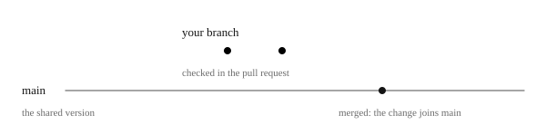

# Pipelines in general

A pipeline is a row of automatic steps that checks every change to a program and delivers it to the people who use it. It works like an assembly line: the same stations, in the same order, every time. Teams use one because doing this by hand goes wrong in ways that are easy to predict.

Nothing here is special to Hjulverkstan, so if you already know pipelines and the everyday words of software work, you lose nothing by skipping it. The last two sections, on watching a run and on reading and building a workflow, are the exception: they are for anyone who will work with GitHub Actions, so skip them only if you already know GitHub Actions.

\
The same four questions, answered by hand and by a pipeline.

*Reasoned. The problems of delivering by hand are common experience in software, not seen in this project's own history.*

## 1. Delivering by hand

Doing it by hand is a circle, where each problem makes the next one worse.

A developer builds the new version on their own laptop, turning the code into a program that can run. They copy it to the server, the computer the program runs on for its users, and start it again. One day they forget a step, or their laptop has a setting the server does not. The program stops working on a Monday morning. Nobody is sure which version is running, or what changed. So people become afraid of releasing. They release rarely, and each release holds many changes, which makes the next one even riskier.

A pipeline breaks that circle. The steps are written down once and run by a machine, so none is forgotten. Every change is checked before it goes anywhere. Every version has a name, so anyone can see what runs where. And because releasing becomes safe and routine, it can happen often, in small steps that are easy to check.

*Reasoned, as above.*

## 2. CI and CD

A pipeline does two things, and they have names you will meet everywhere: CI checks every change, and CD delivers it.

*Common usage of the two names, not checked against a source.*

### 2.1 CI, continuous integration

CI means that every change is checked automatically, each time it is merged, joined, into the shared code, the one version everyone works from. Small changes checked often are easier to fix than big ones checked rarely.

In Hjulverkstan's pipeline, CI is [checking every change](../check.md).

*Common usage, not checked against a source.*

### 2.2 CD, continuous delivery

CD means that every checked change is delivered automatically, at least to a place where it can be tried.

Some teams go further, with continuous deployment, and send every change all the way to the users by itself. Others, like Hjulverkstan, let a person decide when a change reaches the users. In Hjulverkstan's pipeline, CD is [delivering to dev, test and prod](../deliver.md).

*Common usage, not checked against a source.*

## 3. The words

A few everyday words of software work appear on every page. Each is given here once, so the other pages can use them without stopping to explain.

- Code: the text a program is written in.

- Git: the tool that keeps every version of the code, so nothing is lost and anyone can see what changed, when and by whom. The code together with its history is a repository.

- Commit: a saved version of the code, with a note saying what changed.

- Branch: your own copy of the code, where you make a change without disturbing anyone.

- `main`: the shared version of the code that everyone works from.

- Pull request: a request to add the change on your branch to `main`, where others can review it first.

- Merge: adding the change to `main`, once the pull request is accepted.

\
A branch leaves `main`, holds your commits, and joins `main` again when its pull request is merged.

- Tag: a name, such as `v1.4.0`, pinned to one commit.

- Semantic versioning: numbering versions as three numbers, such as `1.4.0`, so the number says how big the change is.

- Build: turning the code into something that can run.

- Deploy: putting a built program where its users can reach it.

- Docker image: a program packed with everything it needs to run, so it runs the same on any machine.

- Container: a running copy of a Docker image.

- Environment: one whole running copy of a system, with its own data. A team usually keeps practice copies for trying changes beside the one the users use, so a mistake on one cannot harm the others.

- GitHub: the site where the repository is kept.

- GitHub Actions: GitHub's own service for running pipelines. A pipeline is written as workflow files in the folder `.github/workflows/`, and GitHub runs them on its own machines when something happens in the repository, such as a pull request or a merge. Its Actions tab lists every run.

*Common usage.*

## 4. Watching a run

Every run can be watched on GitHub, and when one fails, its log says why. Reading one successful run first is the quickest way to feel at home, and makes a failed one much easier to read. Try it:

1. Open the Actions tab. The workflows are listed on the left, each by the name its file gives itself in its first line. Choose one.

2. Open the newest run. A workflow can write a summary at the top, saying what it decided.

3. Below it is the graph of the run's steps, drawn as boxes. A box with nothing to do is shown as skipped.

4. Open one of the boxes in the graph, then a step. Its log is what the machine printed.

A pull request's checks look the same. Open them from the pull request.

A failed run is red in the Actions tab, and on the pull request if it came from one. Its reason is three clicks away: open the run, then the red box in its graph, then the red step.

*Reasoned, from how GitHub shows a run. Not tried in this repository, nor checked against a failing run.*

## 5. Reading and building a workflow

A workflow file holds every detail of what a pipeline does, and a dozen words are enough to read one. The page teaches them one at a time, on Hjulverkstan's own files.

[Reading a workflow](reading.md)

Knowing the words, what remains is why a workflow is laid out the way it is. A few ideas are shared by most good pipelines, and they tell you where a change belongs and how to make it safely.

[What a good pipeline is built on](ideas.md)

*Each page gives its own grounds.*