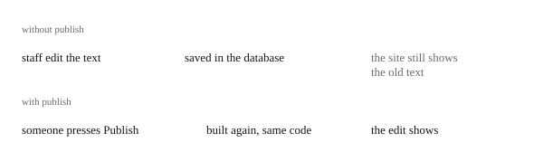

# Republishing the site's content

Staff change the public site's text and images in web edit, the part of the portal made for it, but visitors keep seeing the old text. The site's pages are written ahead of time, which is what makes them fast, so an edit only shows once the site is built again. Republishing does exactly that: it rebuilds the site with the newest content, from the code already running, and changes no code.

\
An edit is saved at once, but visitors only see it after a publish.

The workflow is `publish.yml`, and today it is started by hand.

*An agent's reading of the workflow files, not checked against a real run.*

## 1. Why an edit needs a rebuild

The site is fast because every page is written in advance, with its content inside, as [the web's path](web.md#1-built-into-finished-pages) explains. The cost is that the pages do not change when the content does.

An edit in web edit changes the database, not the pages. The pages still hold the text from the last build, until the site is built again.

*Seen, in `stage-build-web.yml` and `web/src/server.tsx`.*

## 2. How publish rebuilds

Publish must not bring in new code by accident, so it rebuilds from exactly the commit that is already running.

You start it with the *Run workflow* button in GitHub's [Actions tab](basics/README.md#5-pipelines-on-github), and choose the environment. It reads that environment's [`version.json`](web.md#2-deployed-to-s3-and-cloudfront), a file every deploy writes with the version and commit, from its storage to find the commit. Then it builds the web from that commit, with the content as it is now, and deploys it with the same version. It uses the same [build and deploy stages](deliver.md#32-build-and-deploy-one-path-for-each-part) as a delivery.

*Seen, in `publish.yml`.*

## 3. What is planned

Publish is meant to be started from web edit itself, so staff will not need GitHub. The commit that added it says it will later be triggered through the API from web edit, and is manual for now.

*Held open: the author's stated plan in commit `da06213`, 2026-01-12. Nothing in the repository starts publish yet.*
