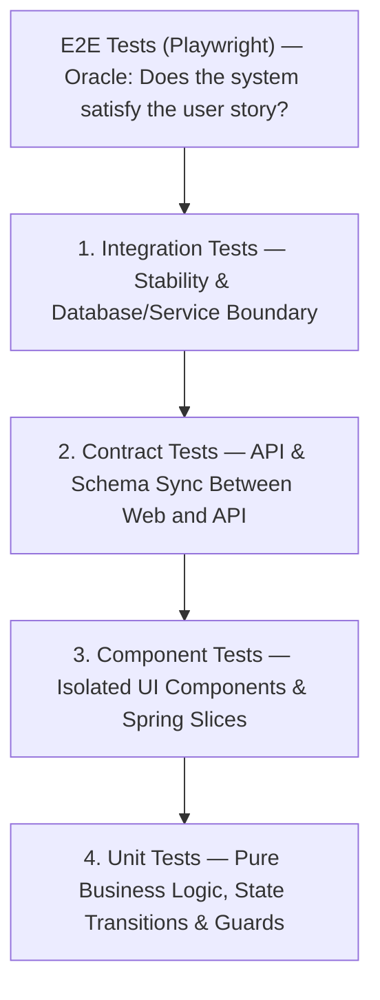

# Testing Implementation Tracks: Layered Safety & Team Autonomy

*A guide for the three-person engineering team to implement layered test suites supporting the user stories (US-0 through US-4) in strict order of execution: **Integration Tests $\rightarrow$ Contract Tests $\rightarrow$ Component Tests $\rightarrow$ Unit Tests**.*

## The Strategy: Clarity Through Layered Tests

When the suite is built from the outside in (E2E golden paths) down to the fastest unit logic, each layer answers a different question:



```
Order of Implementation:
  1. Integration Tests  → Guarantee persistence, transactions, and service boundaries.
  2. Contract Tests     → Lock API request/response shapes & 3rd-party SMS stubs.
  3. Component Tests    → Verify UI dialogs, filters, forms, and Spring controller slices.
  4. Unit Tests         → Exhaustively cover pure domain logic, rules, and edge cases.
```

---

## Three Complementary Lanes

The lanes are split across the team members to give each person clear ownership of their domain while requiring explicit touchpoints and contract handoffs that spark natural pairing and collaborative learning.

| Lane | Focus | Primary Tools | File |
|---|---|---|---|
| **Lane A: Backend Domain & State Engine** | Service boundaries, DB migrations, persistence rules, and pure domain state machines. | Spring Boot, Testcontainers, JUnit 5, Mockito | [wiki/test_tracks/lane-a-backend-domain.md](wiki/test_tracks/lane-a-backend-domain.md) |
| **Lane B: Contracts, Integration Bridge & Harness** | Schema validation, REST API contracts, SNS stubs, CI pipelines, and full-stack glue. | OpenAPI / Pact, WireMock / LocalStack, Spring MockMvc, GitHub Actions | [wiki/test_tracks/lane-b-contracts-and-integration-bridge.md](wiki/test_tracks/lane-b-contracts-and-integration-bridge.md) |
| **Lane C: Frontend Client Flows & UI Components** | UI client flows, interactive forms, status controls, filter bars, and pure UI utilities. | Vitest, React Testing Library, MSW (Mock Service Worker) | [wiki/test_tracks/lane-c-frontend-client-flows.md](wiki/test_tracks/lane-c-frontend-client-flows.md) |

---

## Collaboration & Handoff Touchpoints

1. **The Contract Pairing (A $\longleftrightarrow$ B $\longleftrightarrow$ C)**:
   * When Lane A implements service logic for US-1 (Repair) and US-2 (Rental), Lane B formalizes the OpenAPI schema. Lane C uses that schema to build frontend validation schemas (Zod).
2. **The Notification Stub Sync (A $\longleftrightarrow$ B)**:
   * Lane A writes the `NotificationService` call; Lane B wires the WireMock/LocalStack SNS mock in the shared test harness.
3. **The Dialog & Guard Verification (C $\longleftrightarrow$ A)**:
   * Lane C builds component tests for customer deletion dialogs (US-3); Lane A confirms the backend integration test returns identical 400/409 errors for active tickets.

---

## How This Achieves Autonomy

By following these tracks to completion:
1. Every user story is anchored by an **integration test** in CI.
2. Breaking schema changes are caught immediately by **contract tests**.
3. UI regressions are pinpointed instantly by **component tests**.
4. Edge cases are isolated cheaply in milliseconds by **unit tests**.

The team will not need external instructions on what to implement next—the tests themselves will expose exactly what is green, what is broken, and where new features must plug in.
